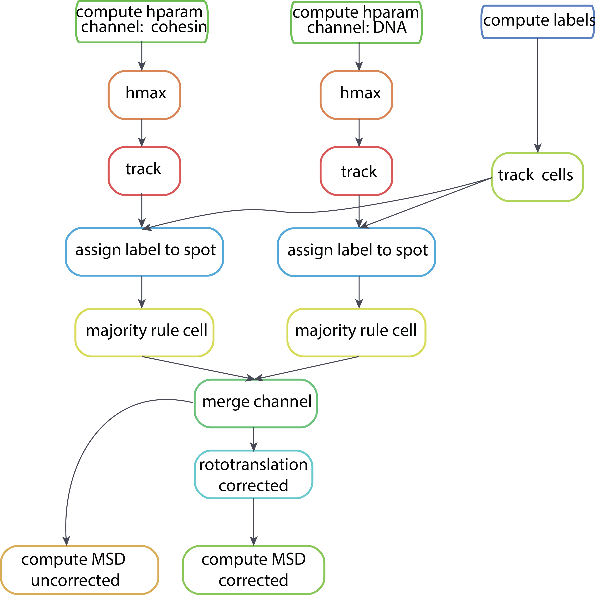

<!-- start abstract -->
# Cohesin_Live_Cell_Analysis

This is a repository to analyze the live-cell imaging data of cohesin and DNA.

## Repository Overview
* `docs`: Contains all project documentation.
* `infrastructure`: Contains detailed installation instructions for all requried tools.
* `ipa`: Contains all image-processing-and-analysis (ipa) scripts which are used for this project to generate final results.
* `runs`: Contains all config files which were used as inputs to the scripts in `ipa`.
* `scratchpad`: Contains everything that is nice to keep track of, but which is not used for any final results.

## Setup
Detailed install instructions can be found in [infrastructure/README.md](infrastructure/README.md).

## Usage

The workflow is written to be used with [snakemake](https://snakemake.readthedocs.io/en/stable/). No installation is required to run the workflow, simply the conda environment.

The steps and code to execute the workflow is contained in the Snakefile document.

A simplified visual representation of the workflow is shown below:



To run the pipeline cd in this folder and type:

```shell
snakemake -cores 1

```

With `-cores n`, n being the number of cores you want to use. If no core argument is given, the number of used cores is determined as the number of available CPU cores in the machine.

If you want a dry run showing all the steps

```shell
snakemake -np

```

To visualize the DAG (directed acyclic graph) which corresponds to a vizualization of the workflow with the different steps you can write:

```shell
snakemake --forceall --dag | dot -Tpdf > dag.pdf
```
## Source code

The whole pipeline is written in python, all the function used by snakemake can be found in [utils](ipa/src/utils.py). All the packages necessary for the execution of utils are in the enivironment. In the notebook [test_workflow.ipynb](scratchpad/test_workflow.ipynb) you can run all the steps without using snakemake.

# Notebooks

In this repository you will find jupyter-notebooks allowing to analyze the results of the pipeline. Mainly: [analyze_results.ipynb](scratchpad/analyze_results.ipynb) and [visualize_results.ipynb](scratchpad/visualize_results.ipynb). 
<!-- end abstract -->

<!-- ## Citation
Do not forget to cite our [publication]() if you use any of our provided materials.

----->
This project was generated with the [faim-ipa-project](https://fmi-faim.github.io/ipa-project-template/) copier template. 

